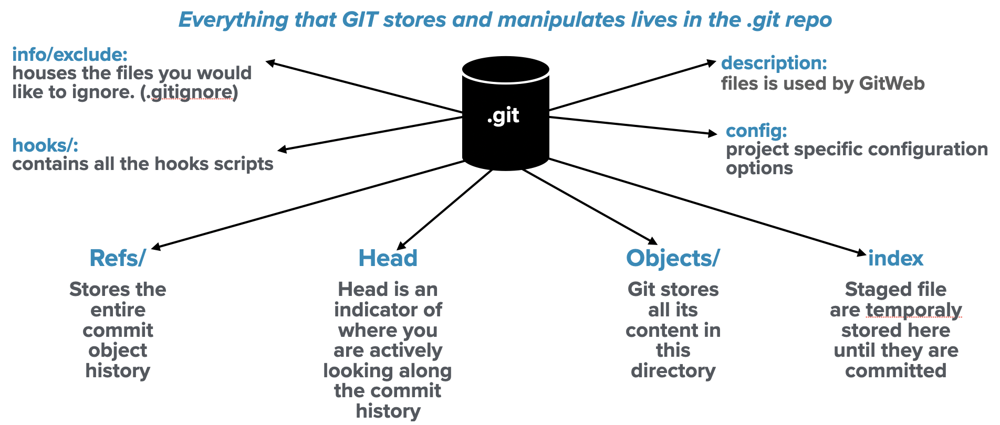
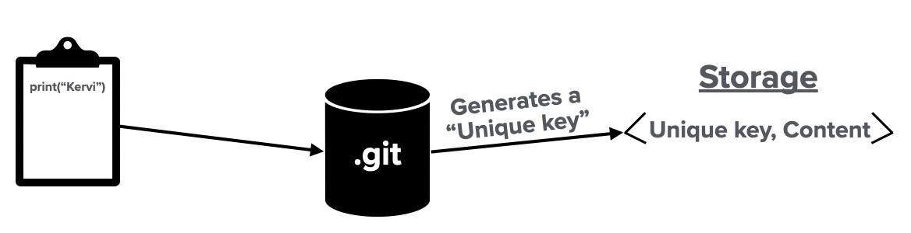
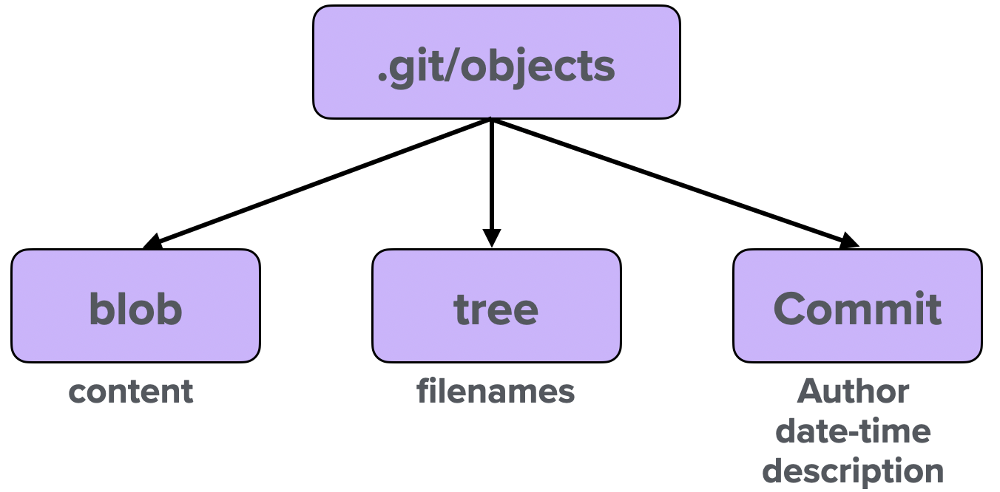

# GIT - Version Control System
Git is a "content addressable filesystem" with a version control interface. Git is primarily known for allowing its users to collaborate in large projects and keep track of any files. This page will walk through the GIT's data model and summarize the commands available in git.

### Summary of resources
The following resources can be found in this repository folder structure

    GIT-VCS-Resources/
    |- README.md           # Repository overview
    |
    |- keyNote/            # Git keynote presentation
    |
    |- pdfs/               # Git presentation in pdf format
    |
    |- pngs/               # Reference images

## Git Data Model - Content-Addressable Filesystem Structure

In order to understand how the "git" data model works, we must dive into the ".git" file directory. Every time we initialize a "git" repository using the porcelain command `git init`, "git" automatically creates a hidden directory called ".git". The ".git" directory and sub-directories are responsible for storing and manipulating the data that lives this directory. The ".git" database typically has the following sub-directories;

  - description - file used by the GitWeb program
  - config - project specific configuration options
  - info/ - stores the .gitignore patterns
  - hooks - client and server side hook scripts used for automation
  - HEAD - points to the ref pointer (branch) you are currently on
  - refs/ - stores a pointer into commit objects, which makes the commit object easily accessable
  - index - Stores all of the staging information
  - object/ - the object database stores all content for the .git database

The figure below summarizes the git files created in the directory we are interested in tracking our changes.

  

The main files responsible for describing "git's" data model are the HEAD, refs/, index, and object/. In this section, the team explains git's data storage and model.

### Objects/
Git stores its data in a key-value data struture,and it's saved in the objects directory. Every time the user gives git a piece information to be tracked or version-control, git generates a unique key value called the "SHA1-HASH". The "SHA1-HASH" key is a unique 40 character checksum hash that gets store in the objects directory. The image below shows a high level flow of object storage in a key-value data format.

  

If would like to further your understanding on how SHA1 hash get generated see the [Object Storage section](https://git-scm.com/book/en/v2/Git-Internals-Git-Objects).

Git stores three main objects in order to recall a snapshot of your file system at any point in time. These three objects, blob, tree and commit objects and such of objects are outlined in the image below.

  

The "blob" object is responsible for storaging the content present in the directory. The blob object is made up of a SHA1 hash key that stores the information present inside a file or files. A "tree" object allows git to store the filename of the content and also allows the user to store a group of files together. "Tree" objects are created from "blob" objects. In the same way content is stored in a file. The "commit" object references the "tree" object and the associated blob objects. The "commit" object allows users to append additional information about the stored snapshot. The "commit" object appends the author and committer information, the date and time of the commit, and a description of the commit. The commit object allows users to recall a snapshot throught a single object, "commit" object, instead of the tree and blob objects.

### refs/
The git reference directory stores the entire "commit" object history. Instead of remembering the SHA-1 value to display the commit object history, the refs/head file is used to reference the objects history.

### HEAD
The "HEAD" file is a symbolic reference to the branch reference you are currently on. The HEAD is an indicator of where you are actively looking from.

### index
The index file contains all the tree objects staged in the file directory. Whenever the user makes a commit, git gathers the staged information (tree objects < blob object) saved in the index file.

## Git Commands - Version Control Interface

#### Basics

* `git init` initializes the .git database
* `git clone <url>` downloads a remote repository to your local working space
* `git status` or `git status -s` summarizes the current state of your repo
* `git add <filename(s)>` stages files for the next commit
* `git diff <filename>` shows the difference between the staged and the modified file
* `git diff --staged` shows the difference between committed and the staged files
* `git commit -m "commit message"` creates a commit to the .git repo with a message
* `git commit -a -m "commit message"` stages the modified files and commits the files
* `git rm <filename>` removes a file
* `git mv <oldfilename> <newFilename>` renames any tracked file
* `git log --graph --decorated` shows the git history in graph format

#### Remotes

* `git remote -v`  showing your remotes repositories
* `git remote show <name>` detail metadata of remote repo
* `git remote add <name> <url>` add the remote repository with specifed name
* `git remote rename <old> <new>` renames the remote repo
* `git remote remove <name>` removes remote tracking branches and configuration settings associates with that remote
* `git pull <name>`  Fetches and merges the remote branch into your current local master branch
* `git fetch <name>` Downloads the remote repo without downloading
* `git push <RemoteName> <BranchName>` Uploads your local branch data to the remote branch. You must have write access

#### Undoing

* `git commit --amend` allows you add missing files to your commit or modified the commit message
* `git reset HEAD <filename>` unstages a file
* `git checkout --<filename>` discard changes

#### Tagging

* `git tag <tagName>` creates a lighweight tag reference
* `git tag -a <tagName> -m “message”` creates an annotated tag object
* `git tag [-l or —list]`  list all available tags
* `git show <tagName>` shows extra tag information
* `git push origin <tagName> or —tags` uploads the tags to your remote repo
* `git tag -d <tagName>` deletes a tag on your local repository

#### Branching

* `git branch <branchName>` creates a new branch (or new pointer that allows you to move around)
(The "HEAD" pointer indicates the branch you are currently on)
* `git checkout <branchName> ` switch to other branches available in your repo (Noticed the location of the HEAD pointer)
* `git checkout -b <branchName>` creates and switches to the branch you specified in the command
* `git merge <BranchwithFixes>` merges the changes from the "BranchwithFixes" to the branch you would like to update (ex: "master" branch)
* `git branch -d <branchName>` deletes the branch (you are responsible for deleting branches that have been merged to master and are not longer needed) -D option forces deleting a branch that has not been merged yet
* `git mergetool` graphical tool to resolve merge conflicts (primarily available in MacOS)
* `git branch` list all the existing branches in your repository (the `*` indicates the branch you are currently on)
* `git branch -v` list all existing branch with last commit on each branch
* `git branch --merged or --no-merged` filters for branch that meet the option criteria
* `git branch -vv` shows the tracking branches
* `git push origin --delete <remoteBranchName>` deletes a remote branch
* `git rebase <ToBranchName>` replays changes target branch from the branch you are currently on. Rebase is the best approach for contributing to other's people project, since its features maintains a clean linear commit history
* `git rebase --onto <Master> <topicoNE> <topicTwo>` rebasing the topicTwo branch to the Master branch
* `git pull --rebase` Attempts to fix rebases that other people have based their work on

#### Advanced Tools In GIT
(UNDER DEVELOPMENT - To be updated soon @KerviRamos)

## REFERENCES
1. [Pro Git by Scott Chacon and Ben Straub](https://git-scm.com/book/en/v2) Pro Git contains all the information you need to learn Git. A lot of the material derived in this repository comes from reading Pro Git and my personal experience using git.

2. [Oh dangit, Git!?! by Katie Sylor-Miller](https://dangitgit.com/en) Great blog/site outlining ways to get out of bad situations in git. If you have some issues while using git, this blog will save your life.
