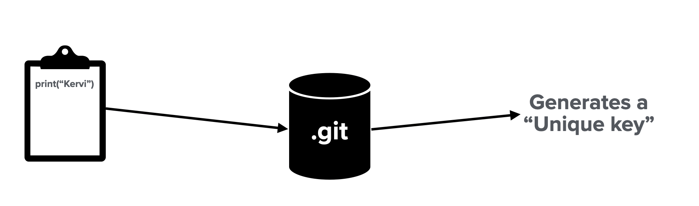

# GIT - Version Control System
Git is a "content addressable filesystem" with a version control interface. Git is primarily known for allowing its user to collaborate in large projects and keep track of any files. This page will walk through the GIT's data model and summarize the commands available in git.

### Summary of resources
The following resources can be found in this repository folder structure

    GIT-VCS-Resources/
    |- README.md           # Repository overview
    |
    |- keyNote/            # Git keynote presentation
    |
    |- pdfs/               # Git presentation in pdf format
    |
    |- pngs/               # reference images

## Git Data Model - Content-Addressable Filesystem Structure
How does the "content addressable filesystem works or what does it even mean?
At its core has a unique way it stores data. Git stores data in a key-value format.

(data model will be explain here - UNDER DEVELOPMENT 👇🏼)

How does the "unique key" gets generated?

Unique key = SHA1 hash value - 40 character checksum hash

Blod Object:
* Content = "What is your purpose? What are you here todo?"
* header = "blob#{content.length}\0"
* Store = header + content
* SHA1 = Digest::SHA1.hexdigest(Store)

Objects

(data model will be explain here - UNDER DEVELOPMENT 👆🏼)

## Git Commands - Version Control Interface

#### Basics

* `git init` initializes the .git database
* `git clone <url>` downloads a remote repository to your local working space
* `git status` or `git status -s` summarizes the current state of your repo
* `git add <filename(s)>` stages files for the next commit
* `git diff <filename>` shows the difference between the staged and the modified file
* `git diff --staged` shows the difference between committed and the staged files
* `git commit -m "commit message"` creates a commit to the .git repo with a message
* `git commit -a -m "commit message"` stages the modified files and commits the files
* `git rm <filename>` removes a file
* `git mv <oldfilename> <newFilename>` renames any tracked file
* `git log --graph --decorated` shows the git history in graph format

#### Remotes

* `git remote -v`  showing your remotes repositories
* `git remote show <name>` detail metadata of remote repo
* `git remote add <name> <url>` add the remote repository with specifed name
* `git remote rename <old> <new>` renames the remote repo
* `git remote remove <name>` removes remote tracking branches and configuration settings associates with that remote
* `git pull <name>`  Fetches and merges the remote branch into your current local master branch
* `git fetch <name>` Downloads the remote repo without downloading
* `git push <RemoteName> <BranchName>` Uploads your local branch data to the remote branch. You must have write access

#### Undoing

* `git commit --amend` allows you add missing files to your commit or modified the commit message
* `git reset HEAD <filename>` unstages a file
* `git checkout --<filename>` discard changes

#### Tagging

* `git tag <tagName>` creates a lighweight tag reference
* `git tag -a <tagName> -m “message”` creates an annotated tag object
* `git tag [-l or —list]`  list all available tags
* `git show <tagName>` shows extra tag information
* `git push origin <tagName> or —tags` uploads the tags to your remote repo
* `git tag -d <tagName>` deletes a tag on your local repository

#### Branching

* `git branch <branchName>` creates a new branch (or new pointer that allows you to move around)
(The "HEAD" pointer indicates the branch you are currently on)
* `git checkout <branchName> ` Switch to other branches available in your repo (Noticed the location of the HEAD pointer)
* `git checkout -b <branchName>` creates and switches to the branch you specified in the command
* `git merge <BranchwithFixes>` merges the changes from the "BranchwithFixes" to the branch you would like to update (ex: "master" branch)
* `git branch -d <branchName>` deletes the branch (You are responsible to delete branches that have been merged to master and are not longer need it) -D option forces deleting a branch that has not been merged yet
* `git mergetool` graphical tool to resolve merge conflicts (primarily available in MacOS)
* `git branch` list all the existing branches in your repository (the `*` indicates the branch you are currently on)
* `git branch -v` list all existing branch with last commit on each branch
* `git branch --merged or --no-merged` filters for branche that meet the option criteria
* `git branch -vv` shows the tracking branches
* `git push origin --delete <remoteBranchName>` deletes a remote branch
* `git rebase <ToBranchName>` replays changes target branch from the branch you are currently on. Rebase is the best approach for contributing to other's people project, since its features maintains a clean linear commit history
* `git rebase --onto <Master> <topicoNE> <topicTwo>` rebasing the topicTwo branch to the Master branch
* `git pull --rebase` Attempts to fix rebases that other people have based their work on

#### Advanced Tools In GIT
(UNDER DEVELOPMENT)

## REFERENCES
1. [Pro Git by Scott Chacon and Ben Straub](https://git-scm.com/book/en/v2) Pro Git contains all the information you need to learn Git. A lot of the material derived in this repository comes from reading Pro Git and my personal experience using git.

2. [Oh dangit, Git!?! by Katie Sylor-Miller](https://dangitgit.com/en) Great blog/site outlining ways to get out of bad situations in git. If you have some mistakes while using git, this blog will save your life.
